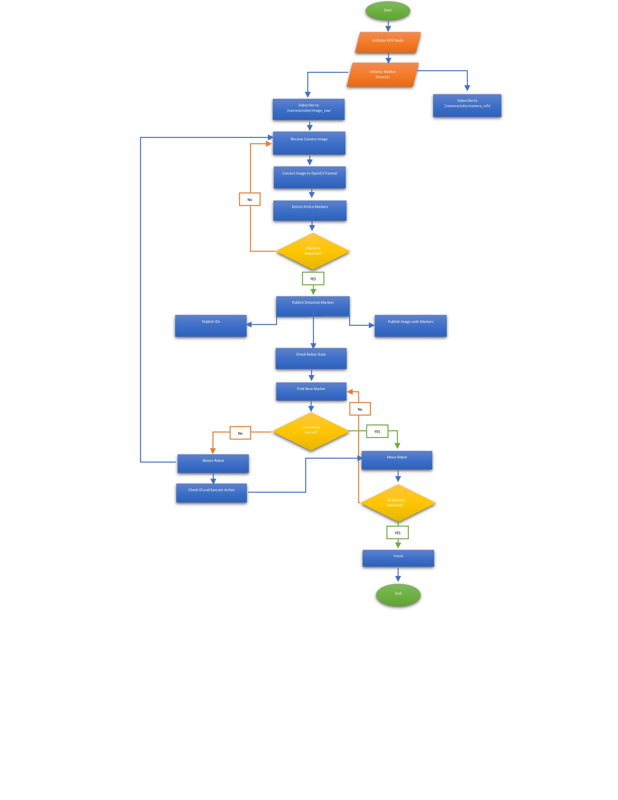

# ROS Package: assignment1_exp_rob_lab

## Introduction

Welcome to the `assignment1_exp_rob_lab` ROS package! This package is designed for the Experimental Robotics Lab assignment 1. It involves simulating a robot in a virtual world, utilizing ArUco markers for navigation.

## Package Overview

### Folder Structure:

- **src:** Contains Python scripts (`ArUcoMarkerExtractor.py` and `MarkerBasedNavigation.py`) for ArUco marker extraction and robot navigation.
- **launch:** Contains ROS launch files (`MarkerBasedNavigation.launch` and `MarkerBasedNavigation_Full.launch`) for launching Gazebo, RViz, and the robot nodes.
- **config:** Holds RViz configuration file (`rvizconfig.rviz`).
- **worlds:** Contains Gazebo world file (`aruco_assignment.world`).
- **CMakeLists.txt and package.xml:** Define package dependencies, build configuration, and other metadata.
- **setup.py:** Specifies Python scripts to be installed.

### Dependencies:

- rospy
- sensor_msgs
- cv_bridge
- geometry_msgs
- std_msgs
- gazebo_msgs

## Getting Started

Follow these steps to run the ROS package and simulate the robot in a virtual environment:

### Step 1: Build the ROS Package

```bash
catkin_make
```

### Step 2: Source the Workspace

```bash
source devel/setup.bash
```

### Step 3: Launch Gazebo and Navigation Nodes

```bash
roslaunch assignment1_exp_rob_lab MarkerBasedNavigation.launch
```

### Step 4:  Launch RViz for Visualization

```bash
rosrun rviz rviz -d /path/to/assignment1_exp_rob_lab/config/rvizconfig.rviz
```
### Step 5: Observe the Simulation

Gazebo should simulate the robot's environment, and RViz should visualize camera images, ArUco markers, and the robot model.

### Step 6:  Run ArUco Marker Extraction

If you want to observe ArUco marker extraction, uncomment the corresponding lines in `MarkerBasedNavigation.launch`. Save the file and relaunch the package.

### Step 7: Observe Robot Movement

As the simulation runs, the robot should move based on detected ArUco markers.

## Additional Resources

### Flowchart




### Videos

1. [Robot Simulation in Virtual World]


https://github.com/karim7tr/Expermintal_Robotics_assignment_1/assets/118085323/ac85b092-09b4-4444-9526-a5f0f0af1e78


2. [Robot Operation in Real World]


https://github.com/karim7tr/Expermintal_Robotics_assignment_1/assets/118085323/8ae31ac0-af6d-43c4-8629-ced02fced76c


## Running Nodes Separately

In some scenarios, you may want to launch specific nodes individually. Below are the commands to launch Gazebo, RViz, and each node separately.

### Launching Gazebo:

```bash
roslaunch assignment1_exp_rob_lab MarkerBasedNavigation.launch
```

This command launches Gazebo along with other necessary nodes. You can observe the robot's simulated environment in Gazebo.

### Launching RViz for Visualization:

```bash
rosrun rviz rviz -d /path/to/assignment1_exp_rob_lab/config/rvizconfig.rviz
```

This command launches RViz and loads the configuration file for visualization. You can observe camera images, ArUco markers, and the robot model in RViz.

### Running ArUco Marker Extraction Node:

```bash
roslaunch assignment1_exp_rob_lab MarkerBasedNavigation.launch
```

Uncomment the ArUco marker extraction node lines in `MarkerBasedNavigation.launch` if you want to run this node separately. Save the file and relaunch the package.

### Running Robot Navigation Node:

```bash
rosrun assignment1_exp_rob_lab MarkerBasedNavigation.py
```

If you want to run only the robot navigation node without Gazebo or RViz, use this command.

Make sure to source your workspace before running any of the above commands:

```bash
source devel/setup.bash
```
---

## Future Improvements

This package provides a foundation for marker-based navigation in a simulated environment. However, there are several areas where improvements and enhancements can be made to further enhance its capabilities:

### 1. **Localization Enhancement:**
   - Improve the robot's localization accuracy by exploring advanced localization algorithms or techniques.

### 2. **Mapping Strategies:**
   - Implement more sophisticated mapping strategies to create a more detailed and accurate map of the environment.

### 3. **Dynamic Obstacle Avoidance:**
   - Integrate algorithms for dynamic obstacle avoidance to make the robot more adaptive in dynamic environments.

### 4. **Human-Robot Interaction:**
   - Explore methods to enable the robot to interact with humans or respond to specific human gestures or commands.

### 5. **Real-World Deployment:**
   - Extend the capabilities to seamlessly transition from simulation to real-world deployment by addressing hardware-specific considerations.

### 6. **Optimization:**
   - Optimize code and algorithms for improved efficiency, ensuring the package runs smoothly in real-time applications.

Contributions and enhancements are welcome! Feel free to fork the repository, implement improvements, and submit pull requests to contribute to the continuous development of this package.

---
 ### Students:

- Bernard Maacaron
- Ines Haouala
- Benkredda Roumaissa
- Karim Triki
----
